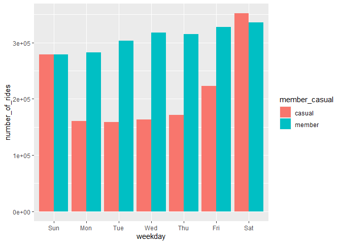
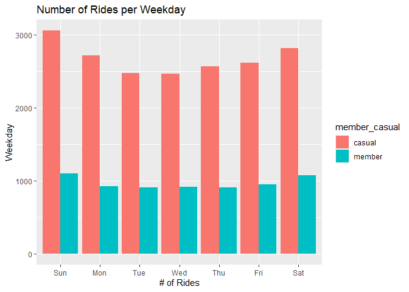
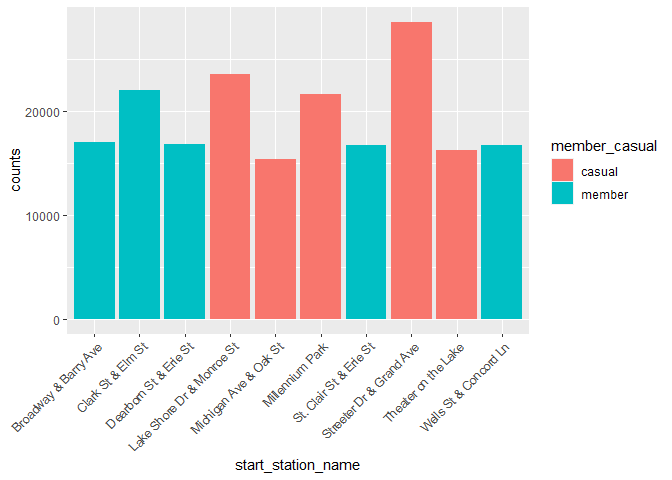
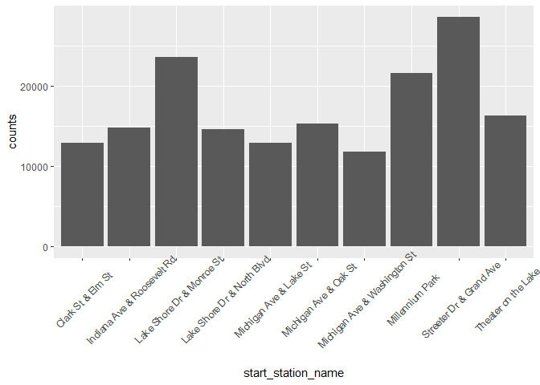
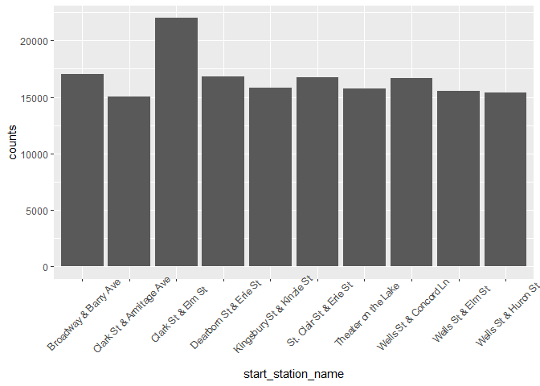
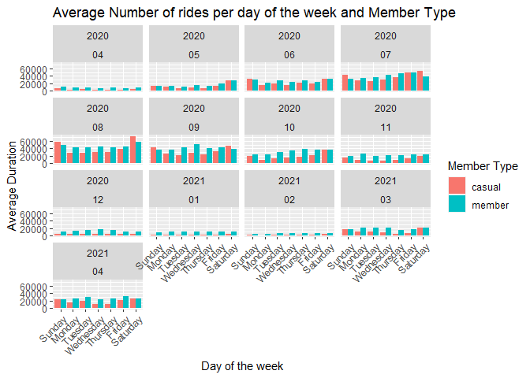
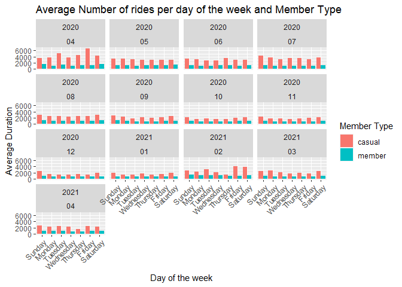

Case Study 1: How Does a Bike-Share Navigate Speedy Success?
================
Douglas Zhong
6/4/2021

-   [Scenario Introduction - sourced from Google Data Analytics
    Certificate
    program](#scenario-introduction---sourced-from-google-data-analytics-certificate-program)
    -   [About the company](#about-the-company)
-   [Main Business Question](#main-business-question)
    -   [Collecting the data](#collecting-the-data)
    -   [Preparing the Data](#preparing-the-data)
-   [Load all our packages](#load-all-our-packages)
-   [Load and inspect the data](#load-and-inspect-the-data)
-   [Preprocess the data](#preprocess-the-data)
-   [Analysis](#analysis)
-   [Plots](#plots)

# Scenario Introduction - sourced from Google Data Analytics Certificate program

You are a junior data analyst working in the marketing analyst team at
Cyclistic, a bike-share company in Chicago. The director of marketing
believes the company’s future success depends on maximizing the number
of annual memberships. Therefore, your team wants to understand how
casual riders and annual members use Cyclistic bikes differently. From
these insights, your team will design a new marketing strategy to
convert casual riders into annual members. But first, Cyclistic
executives must approve your recommendations, so they must be backed up
with compelling data insights and professional data visualizations

## About the company

In 2016, Cyclistic launched a successful bike-share oƸering. Since then,
the program has grown to a fleet of 5,824 bicycles that are geotracked
and locked into a network of 692 stations across Chicago. The bikes can
be unlocked from one station and returned to any other station in the
system anytime.

Until now, Cyclistic’s marketing strategy relied on building general
awareness and appealing to broad consumer segments. One approach that
helped make these things possible was the flexibility of its pricing
plans: single-ride passes, full-day passes, and annual memberships.
Customers who purchase single-ride or full-day passes are referred to as
casual riders. Customers who purchase annual memberships are Cyclistic
members.

Cyclistic’s finance analysts have concluded that annual members are much
more profitable than casual riders. Although the pricing flexibility
helps Cyclistic attract more customers, Moreno believes that maximizing
the number of annual members will be key to future growth. Rather than
creating a marketing campaign that targets all-new customers, Moreno
believes there is a very good chance to convert casual riders into
members. She notes that casual riders are already aware of the Cyclistic
program and have chosen Cyclistic for their mobility needs.

Moreno has set a clear goal: Design marketing strategies aimed at
converting casual riders into annual members. In order to do that,
however, the marketing analyst team needs to better understand how
annual members and casual riders differ, why casual riders would buy a
membership, and how digital media could aƸect their marketing tactics.
Moreno and her team are interested in analyzing the Cyclistic historical
bike trip data to identify trends

# Main Business Question

-   How do annual members and casual riders use Cyclistic bikes
    differently?

### Guiding Questions

-   What is the problem you are trying to solve?
    -   Determine what the trends within the entire Cyclistic biking
        population, as well as within the casual group and members group
    -   Identify if there is a population of casual riders that can
        actually benefit from converting to a membership without further
        incentives
-   How can your insights drive business decisions?
    -   If we identify strong trends, we can create marketing strategies
        that take advantages of these trends to convert casual riders to
        members

## Collecting the data

As Cyclistic is a fictional company, we will be using an existing
open-source data set to simulate the data. Here use the data available
from Divvy Bike Sharing from the months of April 2020 to April 2021.

## Preparing the Data

Initially I was going to perform the beginnings of my analysis on Excel
but the file sizes exceeded what my computer and Excel could handle. I
also looked into using BigQuery as a platform for my initial analysis
but that was also not capable of handling data this size on a free
account. As such, I decided to use R and Rstudio for my entire analysis.

# Load all our packages

``` r
library(tidyverse)  #helps wrangle data
```

    ## Warning: package 'tidyverse' was built under R version 4.0.5

    ## -- Attaching packages --------------------------------------- tidyverse 1.3.1 --

    ## v ggplot2 3.3.3     v purrr   0.3.4
    ## v tibble  3.1.1     v dplyr   1.0.6
    ## v tidyr   1.1.3     v stringr 1.4.0
    ## v readr   1.4.0     v forcats 0.5.1

    ## Warning: package 'tibble' was built under R version 4.0.5

    ## Warning: package 'tidyr' was built under R version 4.0.4

    ## Warning: package 'readr' was built under R version 4.0.4

    ## Warning: package 'dplyr' was built under R version 4.0.5

    ## Warning: package 'stringr' was built under R version 4.0.4

    ## Warning: package 'forcats' was built under R version 4.0.4

    ## -- Conflicts ------------------------------------------ tidyverse_conflicts() --
    ## x dplyr::filter() masks stats::filter()
    ## x dplyr::lag()    masks stats::lag()

``` r
library(lubridate)  #helps wrangle date attributes
```

    ## Warning: package 'lubridate' was built under R version 4.0.5

    ## 
    ## Attaching package: 'lubridate'

    ## The following objects are masked from 'package:base':
    ## 
    ##     date, intersect, setdiff, union

``` r
library(ggplot2)  #helps visualize data
library(skimr) # for quickly taking a look at the data
```

    ## Warning: package 'skimr' was built under R version 4.0.5

``` r
library(dplyr)
library("ggshadow")
```

    ## Warning: package 'ggshadow' was built under R version 4.0.5

``` r
library("formattable")
```

    ## Warning: package 'formattable' was built under R version 4.0.5

``` r
library(kableExtra)
```

    ## Warning: package 'kableExtra' was built under R version 4.0.5

    ## 
    ## Attaching package: 'kableExtra'

    ## The following object is masked from 'package:dplyr':
    ## 
    ##     group_rows

``` r
library(directlabels)
```

    ## Warning: package 'directlabels' was built under R version 4.0.5

# Load and inspect the data

    ## 
    ## -- Column specification --------------------------------------------------------
    ## cols(
    ##   ride_id = col_character(),
    ##   rideable_type = col_character(),
    ##   started_at = col_datetime(format = ""),
    ##   ended_at = col_datetime(format = ""),
    ##   start_station_name = col_character(),
    ##   start_station_id = col_double(),
    ##   end_station_name = col_character(),
    ##   end_station_id = col_double(),
    ##   start_lat = col_double(),
    ##   start_lng = col_double(),
    ##   end_lat = col_double(),
    ##   end_lng = col_double(),
    ##   member_casual = col_character()
    ## )
    ## 
    ## 
    ## -- Column specification --------------------------------------------------------
    ## cols(
    ##   ride_id = col_character(),
    ##   rideable_type = col_character(),
    ##   started_at = col_datetime(format = ""),
    ##   ended_at = col_datetime(format = ""),
    ##   start_station_name = col_character(),
    ##   start_station_id = col_double(),
    ##   end_station_name = col_character(),
    ##   end_station_id = col_double(),
    ##   start_lat = col_double(),
    ##   start_lng = col_double(),
    ##   end_lat = col_double(),
    ##   end_lng = col_double(),
    ##   member_casual = col_character()
    ## )
    ## 
    ## 
    ## -- Column specification --------------------------------------------------------
    ## cols(
    ##   ride_id = col_character(),
    ##   rideable_type = col_character(),
    ##   started_at = col_datetime(format = ""),
    ##   ended_at = col_datetime(format = ""),
    ##   start_station_name = col_character(),
    ##   start_station_id = col_double(),
    ##   end_station_name = col_character(),
    ##   end_station_id = col_double(),
    ##   start_lat = col_double(),
    ##   start_lng = col_double(),
    ##   end_lat = col_double(),
    ##   end_lng = col_double(),
    ##   member_casual = col_character()
    ## )
    ## 
    ## 
    ## -- Column specification --------------------------------------------------------
    ## cols(
    ##   ride_id = col_character(),
    ##   rideable_type = col_character(),
    ##   started_at = col_datetime(format = ""),
    ##   ended_at = col_datetime(format = ""),
    ##   start_station_name = col_character(),
    ##   start_station_id = col_double(),
    ##   end_station_name = col_character(),
    ##   end_station_id = col_double(),
    ##   start_lat = col_double(),
    ##   start_lng = col_double(),
    ##   end_lat = col_double(),
    ##   end_lng = col_double(),
    ##   member_casual = col_character()
    ## )
    ## 
    ## 
    ## -- Column specification --------------------------------------------------------
    ## cols(
    ##   ride_id = col_character(),
    ##   rideable_type = col_character(),
    ##   started_at = col_datetime(format = ""),
    ##   ended_at = col_datetime(format = ""),
    ##   start_station_name = col_character(),
    ##   start_station_id = col_double(),
    ##   end_station_name = col_character(),
    ##   end_station_id = col_double(),
    ##   start_lat = col_double(),
    ##   start_lng = col_double(),
    ##   end_lat = col_double(),
    ##   end_lng = col_double(),
    ##   member_casual = col_character()
    ## )
    ## 
    ## 
    ## -- Column specification --------------------------------------------------------
    ## cols(
    ##   ride_id = col_character(),
    ##   rideable_type = col_character(),
    ##   started_at = col_datetime(format = ""),
    ##   ended_at = col_datetime(format = ""),
    ##   start_station_name = col_character(),
    ##   start_station_id = col_double(),
    ##   end_station_name = col_character(),
    ##   end_station_id = col_double(),
    ##   start_lat = col_double(),
    ##   start_lng = col_double(),
    ##   end_lat = col_double(),
    ##   end_lng = col_double(),
    ##   member_casual = col_character()
    ## )
    ## 
    ## 
    ## -- Column specification --------------------------------------------------------
    ## cols(
    ##   ride_id = col_character(),
    ##   rideable_type = col_character(),
    ##   started_at = col_datetime(format = ""),
    ##   ended_at = col_datetime(format = ""),
    ##   start_station_name = col_character(),
    ##   start_station_id = col_double(),
    ##   end_station_name = col_character(),
    ##   end_station_id = col_double(),
    ##   start_lat = col_double(),
    ##   start_lng = col_double(),
    ##   end_lat = col_double(),
    ##   end_lng = col_double(),
    ##   member_casual = col_character()
    ## )
    ## 
    ## 
    ## -- Column specification --------------------------------------------------------
    ## cols(
    ##   ride_id = col_character(),
    ##   rideable_type = col_character(),
    ##   started_at = col_datetime(format = ""),
    ##   ended_at = col_datetime(format = ""),
    ##   start_station_name = col_character(),
    ##   start_station_id = col_double(),
    ##   end_station_name = col_character(),
    ##   end_station_id = col_double(),
    ##   start_lat = col_double(),
    ##   start_lng = col_double(),
    ##   end_lat = col_double(),
    ##   end_lng = col_double(),
    ##   member_casual = col_character()
    ## )

    ## 
    ## -- Column specification --------------------------------------------------------
    ## cols(
    ##   ride_id = col_character(),
    ##   rideable_type = col_character(),
    ##   started_at = col_datetime(format = ""),
    ##   ended_at = col_datetime(format = ""),
    ##   start_station_name = col_character(),
    ##   start_station_id = col_character(),
    ##   end_station_name = col_character(),
    ##   end_station_id = col_character(),
    ##   start_lat = col_double(),
    ##   start_lng = col_double(),
    ##   end_lat = col_double(),
    ##   end_lng = col_double(),
    ##   member_casual = col_character()
    ## )
    ## 
    ## 
    ## -- Column specification --------------------------------------------------------
    ## cols(
    ##   ride_id = col_character(),
    ##   rideable_type = col_character(),
    ##   started_at = col_datetime(format = ""),
    ##   ended_at = col_datetime(format = ""),
    ##   start_station_name = col_character(),
    ##   start_station_id = col_character(),
    ##   end_station_name = col_character(),
    ##   end_station_id = col_character(),
    ##   start_lat = col_double(),
    ##   start_lng = col_double(),
    ##   end_lat = col_double(),
    ##   end_lng = col_double(),
    ##   member_casual = col_character()
    ## )
    ## 
    ## 
    ## -- Column specification --------------------------------------------------------
    ## cols(
    ##   ride_id = col_character(),
    ##   rideable_type = col_character(),
    ##   started_at = col_datetime(format = ""),
    ##   ended_at = col_datetime(format = ""),
    ##   start_station_name = col_character(),
    ##   start_station_id = col_character(),
    ##   end_station_name = col_character(),
    ##   end_station_id = col_character(),
    ##   start_lat = col_double(),
    ##   start_lng = col_double(),
    ##   end_lat = col_double(),
    ##   end_lng = col_double(),
    ##   member_casual = col_character()
    ## )
    ## 
    ## 
    ## -- Column specification --------------------------------------------------------
    ## cols(
    ##   ride_id = col_character(),
    ##   rideable_type = col_character(),
    ##   started_at = col_datetime(format = ""),
    ##   ended_at = col_datetime(format = ""),
    ##   start_station_name = col_character(),
    ##   start_station_id = col_character(),
    ##   end_station_name = col_character(),
    ##   end_station_id = col_character(),
    ##   start_lat = col_double(),
    ##   start_lng = col_double(),
    ##   end_lat = col_double(),
    ##   end_lng = col_double(),
    ##   member_casual = col_character()
    ## )
    ## 
    ## 
    ## -- Column specification --------------------------------------------------------
    ## cols(
    ##   ride_id = col_character(),
    ##   rideable_type = col_character(),
    ##   started_at = col_datetime(format = ""),
    ##   ended_at = col_datetime(format = ""),
    ##   start_station_name = col_character(),
    ##   start_station_id = col_character(),
    ##   end_station_name = col_character(),
    ##   end_station_id = col_character(),
    ##   start_lat = col_double(),
    ##   start_lng = col_double(),
    ##   end_lat = col_double(),
    ##   end_lng = col_double(),
    ##   member_casual = col_character()
    ## )

I noticed that for some months start\_station\_id and end\_station\_id
were doubles, and sometimes they were characters in later months. I
converted all of those types to characters to combine all the dataframes
together

``` r
all_trips <- all_trips %>%
  map(~mutate(., start_station_id = as.character(start_station_id), end_station_id = as.character(end_station_id))) %>%
  bind_rows()
```

# Preprocess the data

We can remove some data as it does not help with our analysis. Latitude
and longitudinal data is included in some earlier datasets but is
removed in later months. If we want to analyze the data by grouping by
days, months, or weeks, we create new date columns from the existing
datetime information.

``` r
# Remove lat and long as this data was dropped beginning in 2020
all_trips <- all_trips %>%
  select(-c(start_lat, start_lng, end_lat, end_lng))

# Inspect the new table that has been created
colnames(all_trips)  #List of column names
```

    ## [1] "ride_id"            "rideable_type"      "started_at"        
    ## [4] "ended_at"           "start_station_name" "start_station_id"  
    ## [7] "end_station_name"   "end_station_id"     "member_casual"

``` r
nrow(all_trips)  #How many rows are in data frame?
```

    ## [1] 3826978

``` r
dim(all_trips)  #Dimensions of the data frame?
```

    ## [1] 3826978       9

``` r
head(all_trips)  #See the first 6 rows of data frame.  Also tail(qs_raw)
```

    ## # A tibble: 6 x 9
    ##   ride_id rideable_type started_at          ended_at            start_station_n~
    ##   <chr>   <chr>         <dttm>              <dttm>              <chr>           
    ## 1 A847FA~ docked_bike   2020-04-26 17:45:14 2020-04-26 18:12:03 Eckhart Park    
    ## 2 5405B8~ docked_bike   2020-04-17 17:08:54 2020-04-17 17:17:03 Drake Ave & Ful~
    ## 3 5DD24A~ docked_bike   2020-04-01 17:54:13 2020-04-01 18:08:36 McClurg Ct & Er~
    ## 4 2A59BB~ docked_bike   2020-04-07 12:50:19 2020-04-07 13:02:31 California Ave ~
    ## 5 27AD30~ docked_bike   2020-04-18 10:22:59 2020-04-18 11:15:54 Rush St & Hubba~
    ## 6 356216~ docked_bike   2020-04-30 17:55:47 2020-04-30 18:01:11 Mies van der Ro~
    ## # ... with 4 more variables: start_station_id <chr>, end_station_name <chr>,
    ## #   end_station_id <chr>, member_casual <chr>

``` r
str(all_trips)  #See list of columns and data types (numeric, character, etc)
```

    ## tibble[,9] [3,826,978 x 9] (S3: tbl_df/tbl/data.frame)
    ##  $ ride_id           : chr [1:3826978] "A847FADBBC638E45" "5405B80E996FF60D" "5DD24A79A4E006F4" "2A59BBDF5CDBA725" ...
    ##  $ rideable_type     : chr [1:3826978] "docked_bike" "docked_bike" "docked_bike" "docked_bike" ...
    ##  $ started_at        : POSIXct[1:3826978], format: "2020-04-26 17:45:14" "2020-04-17 17:08:54" ...
    ##  $ ended_at          : POSIXct[1:3826978], format: "2020-04-26 18:12:03" "2020-04-17 17:17:03" ...
    ##  $ start_station_name: chr [1:3826978] "Eckhart Park" "Drake Ave & Fullerton Ave" "McClurg Ct & Erie St" "California Ave & Division St" ...
    ##  $ start_station_id  : chr [1:3826978] "86" "503" "142" "216" ...
    ##  $ end_station_name  : chr [1:3826978] "Lincoln Ave & Diversey Pkwy" "Kosciuszko Park" "Indiana Ave & Roosevelt Rd" "Wood St & Augusta Blvd" ...
    ##  $ end_station_id    : chr [1:3826978] "152" "499" "255" "657" ...
    ##  $ member_casual     : chr [1:3826978] "member" "member" "member" "member" ...

``` r
summary(all_trips)  #Statistical summary of data. Mainly for numerics
```

    ##    ride_id          rideable_type        started_at                 
    ##  Length:3826978     Length:3826978     Min.   :2020-04-01 00:00:30  
    ##  Class :character   Class :character   1st Qu.:2020-07-19 19:42:40  
    ##  Mode  :character   Mode  :character   Median :2020-09-06 18:00:14  
    ##                                        Mean   :2020-09-29 06:10:30  
    ##                                        3rd Qu.:2020-11-12 16:42:46  
    ##                                        Max.   :2021-04-30 23:59:53  
    ##     ended_at                   start_station_name start_station_id  
    ##  Min.   :2020-04-01 00:10:45   Length:3826978     Length:3826978    
    ##  1st Qu.:2020-07-19 20:22:24   Class :character   Class :character  
    ##  Median :2020-09-06 18:30:35   Mode  :character   Mode  :character  
    ##  Mean   :2020-09-29 06:35:12                                        
    ##  3rd Qu.:2020-11-12 16:58:25                                        
    ##  Max.   :2021-05-05 22:14:39                                        
    ##  end_station_name   end_station_id     member_casual     
    ##  Length:3826978     Length:3826978     Length:3826978    
    ##  Class :character   Class :character   Class :character  
    ##  Mode  :character   Mode  :character   Mode  :character  
    ##                                                          
    ##                                                          
    ## 

``` r
# If we want to analyze the data by grouping by days, months, or weeks, we create new date columns from the existing datetime information

all_trips$date <- as.Date(all_trips$started_at) #The default format is yyyy-mm-dd
all_trips$month <- format(as.Date(all_trips$date), "%m")
all_trips$day <- format(as.Date(all_trips$date), "%d")
all_trips$year <- format(as.Date(all_trips$date), "%Y")
all_trips$day_of_week <- format(as.Date(all_trips$date), "%A")

# Add a "ride_length" calculation to all_trips (in seconds)
all_trips$ride_length <- difftime(all_trips$ended_at,all_trips$started_at)

# Convert "ride_length" from Factor to numeric so we can run calculations on the data
is.factor(all_trips$ride_length)
```

    ## [1] FALSE

``` r
all_trips$ride_length <- as.numeric(as.character(all_trips$ride_length))
is.numeric(all_trips$ride_length)
```

    ## [1] TRUE

``` r
# Assign ride length groups with context
all_trips$group_length <- dplyr::case_when(all_trips$ride_length <900 ~ "Less 15 minutes", 
                                           all_trips$ride_length <3600 ~"Less 1 hour",
                                           all_trips$ride_length <7200 ~"Less 2 hour",
                                           all_trips$ride_length <28800 ~"Less 8 hour",
                                           all_trips$ride_length <86400 ~"Less 1 day",
                                           all_trips$ride_length >=86400 ~"More than 1 day")

# Preliminary count of all trips grouped by year and months
divvy_count <- all_trips %>%
  group_by(year,month) %>%
  dplyr::summarise(totals=n()) 
```

    ## `summarise()` has grouped output by 'year'. You can override using the `.groups` argument.

``` r
order_week <- c('Sunday', 'Monday', 'Tuesday', 'Wednesday','Thursday','Friday','Saturday')

# Remove "bad" data
# The dataframe includes a few hundred entries when bikes were taken out of docks and checked for quality by Divvy or ride_length was negative

all_trips_v2 <- all_trips[!(all_trips$start_station_name == "HQ QR" | all_trips$ride_length<0),]
all_trips_v2 <- filter(all_trips_v2, !is.na(ride_length))

# Noticed that a lot of end station names were missing
# Created 3 separate data frames, one with complete data only, one with the trips that have no end station, and one with ALL trips
all_trips_missing_end <- filter(all_trips, is.na(end_station_name))
all_trips_no_na <- filter(all_trips, !is.na(end_station_name))
```

# Analysis

Now that our data is well organized and ready to be looked at.

    ##    Min. 1st Qu.  Median    Mean 3rd Qu.    Max. 
    ##       0     479     874    1686    1602 3523202

    ##   all_trips_v2$member_casual all_trips_v2$ride_length
    ## 1                     casual                2717.6094
    ## 2                     member                 966.1052

    ##   all_trips_v2$member_casual all_trips_v2$ride_length
    ## 1                     casual                     1278
    ## 2                     member                      689

    ##   all_trips_v2$member_casual all_trips_v2$ride_length
    ## 1                     casual                  3341033
    ## 2                     member                  3523202

    ##   all_trips_v2$member_casual all_trips_v2$ride_length
    ## 1                     casual                        0
    ## 2                     member                        0

    ##    all_trips_v2$member_casual all_trips_v2$day_of_week all_trips_v2$ride_length
    ## 1                      casual                   Friday                2615.8820
    ## 2                      member                   Friday                 945.1852
    ## 3                      casual                   Monday                2715.2761
    ## 4                      member                   Monday                 921.1990
    ## 5                      casual                 Saturday                2817.0078
    ## 6                      member                 Saturday                1070.2137
    ## 7                      casual                   Sunday                3053.4045
    ## 8                      member                   Sunday                1095.5406
    ## 9                      casual                 Thursday                2562.8716
    ## 10                     member                 Thursday                 908.3416
    ## 11                     casual                  Tuesday                2477.4782
    ## 12                     member                  Tuesday                 909.7689
    ## 13                     casual                Wednesday                2466.9220
    ## 14                     member                Wednesday                 915.2750

    ##    all_trips_v2$member_casual all_trips_v2$day_of_week all_trips_v2$ride_length
    ## 1                      casual                   Sunday                3053.4045
    ## 2                      member                   Sunday                1095.5406
    ## 3                      casual                   Monday                2715.2761
    ## 4                      member                   Monday                 921.1990
    ## 5                      casual                  Tuesday                2477.4782
    ## 6                      member                  Tuesday                 909.7689
    ## 7                      casual                Wednesday                2466.9220
    ## 8                      member                Wednesday                 915.2750
    ## 9                      casual                 Thursday                2562.8716
    ## 10                     member                 Thursday                 908.3416
    ## 11                     casual                   Friday                2615.8820
    ## 12                     member                   Friday                 945.1852
    ## 13                     casual                 Saturday                2817.0078
    ## 14                     member                 Saturday                1070.2137

<table class=" lightable-material lightable-striped lightable-hover" style="font-family: &quot;Source Sans Pro&quot;, helvetica, sans-serif; width: auto !important; margin-left: auto; margin-right: auto;">
<caption>
Number of rides group by length
</caption>
<thead>
<tr>
<th style="empty-cells: hide;" colspan="1">
</th>
<th style="padding-bottom:0; padding-left:3px;padding-right:3px;text-align: center; " colspan="3">

<div style="TRUE">

Rows

</div>

</th>
<th style="padding-bottom:0; padding-left:3px;padding-right:3px;text-align: center; " colspan="2">

<div style="TRUE">

Percentage

</div>

</th>
</tr>
<tr>
<th style="text-align:left;">
Group
</th>
<th style="text-align:right;">
Casual
</th>
<th style="text-align:right;">
Member
</th>
<th style="text-align:right;">
Total
</th>
<th style="text-align:right;">
Casual
</th>
<th style="text-align:right;">
Member
</th>
</tr>
</thead>
<tbody>
<tr>
<td style="text-align:left;font-weight: bold;">
Less 1 day
</td>
<td style="text-align:right;">
4704
</td>
<td style="text-align:right;">
822
</td>
<td style="text-align:right;">
5526
</td>
<td style="text-align:right;">
0.13%
</td>
<td style="text-align:right;">
0.02%
</td>
</tr>
<tr>
<td style="text-align:left;font-weight: bold;">
Less 1 hour
</td>
<td style="text-align:right;">
748363
</td>
<td style="text-align:right;">
787591
</td>
<td style="text-align:right;">
1535954
</td>
<td style="text-align:right;">
20.40%
</td>
<td style="text-align:right;">
21.47%
</td>
</tr>
<tr>
<td style="text-align:left;font-weight: bold;">
Less 15 minutes
</td>
<td style="text-align:right;">
528266
</td>
<td style="text-align:right;">
1351761
</td>
<td style="text-align:right;">
1880027
</td>
<td style="text-align:right;">
14.40%
</td>
<td style="text-align:right;">
36.85%
</td>
</tr>
<tr>
<td style="text-align:left;font-weight: bold;">
Less 2 hour
</td>
<td style="text-align:right;">
164093
</td>
<td style="text-align:right;">
16413
</td>
<td style="text-align:right;">
180506
</td>
<td style="text-align:right;">
4.47%
</td>
<td style="text-align:right;">
0.45%
</td>
</tr>
<tr>
<td style="text-align:left;font-weight: bold;">
Less 8 hour
</td>
<td style="text-align:right;">
58606
</td>
<td style="text-align:right;">
4482
</td>
<td style="text-align:right;">
63088
</td>
<td style="text-align:right;">
1.60%
</td>
<td style="text-align:right;">
0.12%
</td>
</tr>
<tr>
<td style="text-align:left;font-weight: bold;">
More than 1 day
</td>
<td style="text-align:right;">
2772
</td>
<td style="text-align:right;">
365
</td>
<td style="text-align:right;">
3137
</td>
<td style="text-align:right;">
0.08%
</td>
<td style="text-align:right;">
0.01%
</td>
</tr>
<tr>
<td style="text-align:left;font-weight: bold;font-weight: bold;">
Total
</td>
<td style="text-align:right;font-weight: bold;">
1506804
</td>
<td style="text-align:right;font-weight: bold;">
2161434
</td>
<td style="text-align:right;font-weight: bold;">
3668238
</td>
<td style="text-align:right;font-weight: bold;">
41.08%
</td>
<td style="text-align:right;font-weight: bold;">
58.92%
</td>
</tr>
</tbody>
</table>

    ## `summarise()` has grouped output by 'member_casual'. You can override using the `.groups` argument.

    ## # A tibble: 14 x 4
    ## # Groups:   member_casual [2]
    ##    member_casual weekday number_of_rides average_duration
    ##    <chr>         <ord>             <int>            <dbl>
    ##  1 casual        Sun              278706            3053.
    ##  2 casual        Mon              160437            2715.
    ##  3 casual        Tue              158627            2477.
    ##  4 casual        Wed              163295            2467.
    ##  5 casual        Thu              171461            2563.
    ##  6 casual        Fri              222434            2616.
    ##  7 casual        Sat              351844            2817.
    ##  8 member        Sun              278734            1096.
    ##  9 member        Mon              282837             921.
    ## 10 member        Tue              303177             910.
    ## 11 member        Wed              317753             915.
    ## 12 member        Thu              315424             908.
    ## 13 member        Fri              327945             945.
    ## 14 member        Sat              335564            1070.

# Plots

    ## `summarise()` has grouped output by 'member_casual'. You can override using the `.groups` argument.

<!-- -->

    ## `summarise()` has grouped output by 'member_casual'. You can override using the `.groups` argument.

<!-- -->

    ## `summarise()` has grouped output by 'member_casual'. You can override using the `.groups` argument.

    ## Selecting by counts

<!-- -->

    ## Selecting by counts

<!-- -->

    ## Selecting by counts

<!-- --><!-- --><!-- -->
